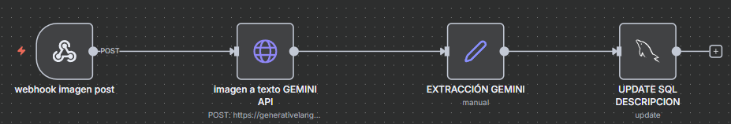
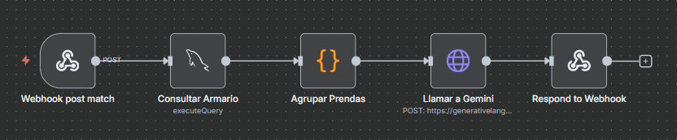
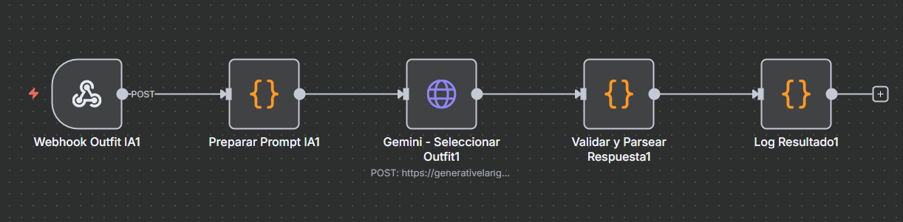
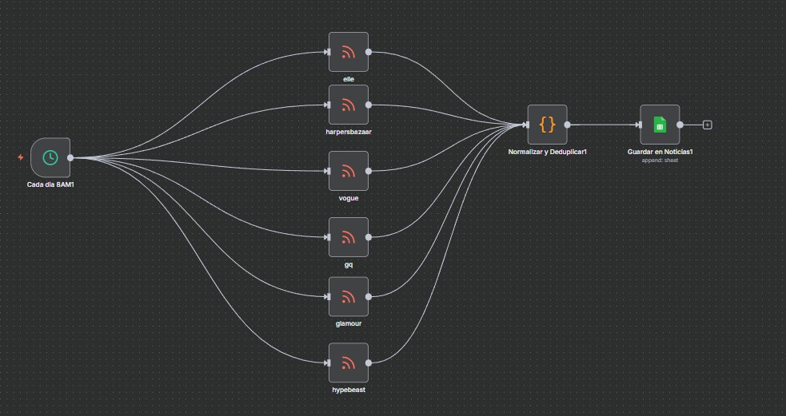
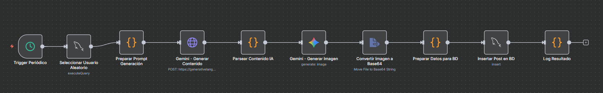
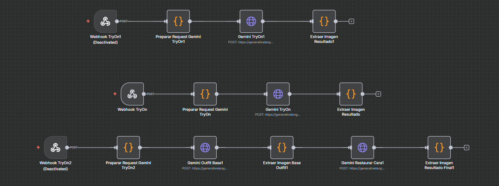

# Workflows de n8n - Wardaropa IA

Aquí se encuentran todos los workflows de n8n que alimentan las funciones de inteligencia artificial de Wardaropa. Cada workflow está optimizado para una tarea específica y se integra seamlessly con la API del backend.

---

## 📋 Índice de Workflows

1. [Generación de Descripción de Prendas](#1-generación-de-descripción-de-prendas)
2. [Match IA - Mejor Combinación](#2-match-ia---mejor-combinación)
3. [Recomendación de Outfits](#3-recomendación-de-outfits)
4. [Scraping y Publicación de Noticias](#4-scraping-y-publicación-de-noticias)
5. [Generador de Posts Demo](#5-generador-de-posts-demo)
6. [Try-On Virtual (Prueba de Outfit)](#6-try-on-virtual-dos-fases)

---

## 1. Generación de Descripción de Prendas

**Archivo:** `wardaropa_imagen_texto_ia_sql_n8n.json`

### Objetivo
Cuando un usuario sube una foto de una prenda al armario, este workflow analiza la imagen y genera automáticamente una descripción detallada: tipo de prenda, color, tejido, estilo, ocasión de uso, etc.

### Flujo de ejecución
1. Webhook recibe la imagen en base64
2. Google Gemini Vision analiza la imagen
3. Genera descripción estructurada (tipo, color, tejido, ocasión)
4. Almacena en BD y retorna al frontend

### Entrada esperada
```json
{
  "imagen_base64": "data:image/jpeg;base64,...",
  "prenda_id": 123
}
```

### Salida esperada
```json
{
  "tipo": "Camiseta",
  "color": "Azul marino",
  "tejido": "Algodón premium",
  "estilo": "Casual",
  "ocasion": "Uso diario",
  "descripcion_completa": "..."
}
```

### Screenshot


---

## 2. Match IA - Compatibilidad con Armario

**Archivo:** `n8n_match_ia_sql.json`

### Objetivo
Cuando un usuario ve una prenda que le interesa, este workflow analiza cómo combina esa prenda con TODO su armario actual. Retorna un score de compatibilidad (0-100%) y una explicación de por qué combina bien o mal.

### Flujo de ejecución
1. Webhook recibe: `usuario_id` + `prenda_id` (prenda a evaluar)
2. Script obtiene la prenda a evaluar de BD
3. Script obtiene TODAS las prendas del armario del usuario
4. Envía imágenes + descripciones a Gemini para análisis comparativo
5. Gemini retorna score de compatibilidad + justificación detallada
6. Almacena resultado en BD

### Entrada esperada
```json
{
  "usuario_id": 42,
  "prenda_id": 234
}
```

### Salida esperada
```json
{
  "match_score": 87,
  "compatibilidad": "Excelente",
  "justificacion": "Esta camiseta azul combina perfectamente con tus pantalones negros y grises. El color neutro se adapta a la mayoría de tus accesorios. Muy versátil.",
  "prendas_compatibles": [
    { "prenda_id": 1, "tipo": "bottom", "razon": "Colores complementarios" },
    { "prenda_id": 3, "tipo": "shoes", "razon": "Estilo casual matching" }
  ],
  "recomendacion": "Buena compra para ampliar tu armario"
}
```

### Screenshot


---

## 3. Recomendación de Outfits

**Archivo:** `wardaropa_outfit_recommendation_ia.json`

### Objetivo
Genera un outfit completo personalizando basándose en una descripción, estado de ánimo o ocasión. El usuario describe qué necesita y la IA combina sus prendas existentes de forma coherente y realista.

### Flujo de ejecución
1. Webhook recibe el usuario_id + descripción/prompt
2. Script obtiene las prendas del usuario de la BD
3. Envía todo a Gemini con el prompt del usuario
4. Gemini selecciona las 4 mejores prendas disponibles
5. Crea el outfit y retorna IDs + descripción

### Entrada esperada
```json
{
  "usuario_id": 42,
  "prompt": "Necesito algo comodo pero elegante para una cita de negocios casual"
}
```

### Salida esperada
```json
{
  "outfit_id": 890,
  "nombre_outfit": "Business Casual Elegante",
  "descripcion": "Combinación profesional pero relajada...",
  "prendas": [
    { "prenda_id": 15, "slot": "top", "foto": "..." },
    { "prenda_id": 22, "slot": "bottom", "foto": "..." },
    { "prenda_id": 8, "slot": "shoes", "foto": "..." },
    { "prenda_id": 33, "slot": "accesorios", "foto": "..." }
  ]
}
```

### Screenshot


---

## 4. Scraping y Publicación de Noticias

**Archivo:** `wardaropa_Scrap_and_post.json`

### Objetivo
Ejecuta scraping automático de fuentes de moda en internet, procesa los artículos con Gemini para extraer resumen e impacto, y publica automáticamente en la sección de Noticias de Wardaropa para mantener el feed siempre actualizado con tendencias reales.

### Flujo de ejecución
1. Cron trigger cada X horas
2. Scraper HTTP obtiene URLs de fuentes de moda (RSS/sitios)
3. Extrae título, descripción, imagen
4. Gemini summariza y clasifica por tendencia
5. Almacena en tabla `noticias` de BD
6. Frontend carga automáticamente al hacer refresh

### Entrada esperada
Ninguna — se ejecuta automáticamente en horarios configurados

### Salida esperada
```sql
INSERT INTO noticias (titulo, descripcion, imagen_url, categoria, fuente, fecha) 
VALUES ('Nueva tendencia 2026: Colores Pastel', '...', 'url_imagen', 'Tendencias', 'Vogue', NOW());
```

### Screenshot


---

## 5. Generador de Posts Demo

**Archivo:** `wardaropa_generar_posts_demo.json`

### Objetivo
Genera contenido de demostración: posts, usuarios ficticios, outfits y fotos de prueba. Útil para llenar la BD durante desarrollo o para mostrar la app sin datos reales.

### Flujo de ejecución
1. Webhook solicita generación de datos demo
2. Script crea usuarios ficticos con nombres y bios generadas
3. Crea prendas aleatorias con imágenes de Unsplash/similares
4. Genera outfits combinando esas prendas
5. Publica posts ficticios con esos outfits
6. Añade likes y comentarios realistas

### Entrada esperada
```json
{
  "cantidad_usuarios": 5,
  "posts_por_usuario": 3,
  "prendas_por_usuario": 8
}
```

### Salida esperada
```json
{
  "usuarios_creados": 5,
  "prendas_creadas": 40,
  "outfits_creados": 15,
  "posts_creados": 15,
  "estado": "Datos de demostración cargados exitosamente"
}
```

### Screenshot


---

## 6. Try-On Virtual (Dos Fases)

**Archivo:** `wardaropa_outfit_tryon_ia.json`

### Objetivo
Permite al usuario subir una foto de cuerpo entero y visualizar cómo le queda cualquier outfit del armario. Utiliza un pipeline de dos fases con Google Gemini para máxima fidelidad:

**Fase 1:** Genera el outfit sobre la silueta preservando pose y fondo.  
**Fase 2:** Restaura la identidad facial exacta del usuario sobre la imagen generada.

### Flujo de ejecución

#### Fase 1: Generación del Outfit Base
1. Webhook recibe foto usuario (full-body) + 4 prendas del outfit
2. Script prepara request Gemini con todas las imágenes
3. Gemini genera imagen del outfit sobre el cuerpo del usuario
4. Resultado se pasa a Fase 2

#### Fase 2: Restauración de Identidad Facial
1. Toma resultado de Fase 1 (outfit generado)
2. Usa foto original del usuario como referencia facial
3. Gemini reemplaza solo cara/cabello preservando outfit exacto
4. Retorna imagen final al frontend

### Entrada esperada
```json
{
  "foto_usuario_base64": "data:image/jpeg;base64,...",
  "outfit_nombre": "Business Casual",
  "outfit_items": [
    { "slot": "top", "foto_prenda_base64": "...", "descripcion_prenda": "Camiseta blanca" },
    { "slot": "bottom", "foto_prenda_base64": "...", "descripcion_prenda": "Pantalón azul marino" },
    { "slot": "shoes", "foto_prenda_base64": "...", "descripcion_prenda": "Zapatos negros" },
    { "slot": "accesorios", "foto_prenda_base64": "...", "descripcion_prenda": "Correa marrón" }
  ]
}
```

### Salida esperada
```json
{
  "imagen_resultado": "data:image/png;base64,..." ,
  "descripcion": "Try-on realista del outfit sobre tu cuerpo con tu rostro preservado"
}
```

### Características técnicas
- **Modelo:** Google Gemini 2.5 Flash Image
- **Fases:** 2 (generación + restauración)
- **Temperatura:** 0.2 (Fase 1) → 0.05 (Fase 2) para máxima precisión
- **Timeout:** 120 segundos por fase
-  Hay 3 workflows ya que hemos conseguido 3 funcionalidades distintas de tryon.
1. Generación outfit perfecta pero sin la ambientación ni rostro de la imagen del usuario.
2. Generación outfit decente con rostro del usuario pero sin la ambientación del usuario.
3. Ambientación perfecta, cara decente, pero outfit regular.
-No hemos conseguido el equilibrio perfecto.

### Screenshot


---

## 🚀 Cómo usar estos workflows

### 1. Importar en n8n
1. Abre tu instancia de n8n
2. Ve a `Import` → `From File`
3. Selecciona el archivo JSON del workflow
4. Configura las credenciales (GEMINI_API_KEY, DB, etc.)
5. Activa el workflow

### 2. Configurar variables de entorno
En el `.env` del backend:
```env
GEMINI_API_KEY=tu_clave_api_gemini
N8N_BASE_URL=http://localhost:5678
N8N_OUTFIT_WEBHOOK_URL=https://TU_N8N_INSTANCE.com/webhook/outfit-recommendation-ia
N8N_OUTFIT_TRYON_WEBHOOK_URL=https://TU_N8N_INSTANCE.com/webhook/outfit-tryon-ia
```

### 3. Conectar con el backend
El backend de Express hace llamadas HTTP a los webhooks de n8n:

```javascript
// Ejemplo: Generación de descripción
const { data } = await axios.post(
  process.env.N8N_DESCRIPCION_WEBHOOK,
  { imagen_base64, prenda_id },
  { timeout: 30000 }
);
```


## 📊 Monitoreo

Cada workflow tiene un log en n8n. Puedes:
- Ver ejecuciones exitosas/fallidas
- Verificar tiempos de respuesta
- Debuggear payloads de entrada y salida

Para monitoreo en producción, añade alertas en:
- Error de API Gemini
- Timeout en BD
- Fallo de conexión a webhook

---

## 📝 Notas de desarrollo

- Todos los workflows usan `mysql2/promise` para BD async
- Las imágenes se pasan en base64 para evitar problemas de codificación
- Gemini Vision tiene límites de rate: máximo 60 llamadas por minuto
- El try-on de dos fases consume 2x cuota de Gemini Vision

---

<p align="center">
  <strong>Last updated:</strong> Marzo 2026<br/>
  <strong>Wardaropa</strong>
</p>
